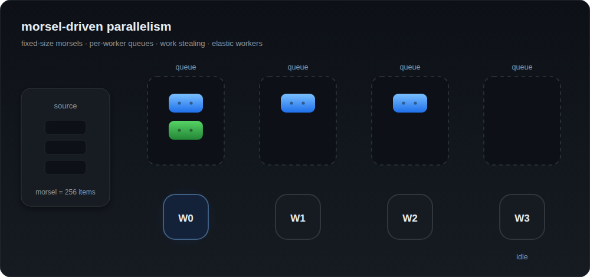

# morsel

**Morsel-driven** parallelism for Go 1.27: work is split into *morsels*
(fixed-size batches), handed to an **elastic** worker pool with **work
stealing**, **bounded** queues, and **zero dependencies**. Based on Leis et al.,
*Morsel-Driven Parallelism* (SIGMOD 2014).

- **Bounded by default**: no queue grows without limit; backpressure is explicit.
- **Elastic**: workers spin up on demand and stop when the work runs out.
- **Work stealing**: an idle worker steals from its peers — great for irregular work.
- **Zero dependencies**: standard library only.
- **Generic**: slices, ranges, `iter.Seq`, readers, and rows.
- **Cancellation and errors** via `context.Context`; the first failure aborts the run.

<p align="center">
  <picture>
    <source srcset="docs/morsel.svg" type="image/svg+xml">
    
  </picture>
</p>

## Contents

- [Install](#install)
- [Getting started](#getting-started)
- [When to use it — and when not to](#when-to-use-it--and-when-not-to)
- [Sizing: small inputs and few workers cost nothing](#sizing-small-inputs-and-few-workers-cost-nothing)
- [Compared to traditional Go](#compared-to-traditional-go)
- [Pipeline](#pipeline)
- [Adapters (sources)](#adapters-sources)
- [Streaming and resource usage](#streaming-and-resource-usage)
- [Allocations](#allocations)
- [Errors and cancellation](#errors-and-cancellation)
- [Reusable executor and stats](#reusable-executor-and-stats)
- [Options](#options)
- [How it works](#how-it-works)
- [Benchmarks](#benchmarks)
- [Package layout](#package-layout)
- [API reference](#api-reference)

## Install

```bash
go get github.com/lrweck/morsel
```

Then:

```go
import "github.com/lrweck/morsel"
```

## Getting started

```go
package main

import (
	"fmt"

	"morsel"
)

type Debt struct{ Amount int }

func main() {
	debts := make([]*Debt, 1_000_000)
	for i := range debts {
		debts[i] = &Debt{Amount: i}
	}

	// ForEach: apply fn to every element in parallel.
	// No options needed — the defaults are sane (GOMAXPROCS workers, 256-item morsels).
	err := morsel.ForEach(debts, func(d *Debt) {
		d.Amount *= 2
	})
	if err != nil {
		panic(err)
	}

	// Pipeline: same sane defaults, no executor to manage.
	total, err := morsel.Slice(debts).
		Map(func(d *Debt) int { return d.Amount }).
		Reduce(0,
			func(acc, v int) int { return acc + v },
			func(a, b int) int { return a + b },
		)
	if err != nil {
		panic(err)
	}
	fmt.Println(total)
}
```

## When to use it — and when not to

**Good fit**

- **CPU-bound work over many elements** — transforms, parsing, scoring,
  aggregations, validation of large batches.
- **Irregular or mixed per-item cost.** Work stealing balances it: a worker that
  finishes its share early takes from a busy peer, which static chunking cannot.
- **Bounded memory while streaming.** Large files, network streams, or query
  results are processed in morsels without materializing everything.
- **You want cancellation and error propagation** without hand-rolling a pool.
- **You do not want to tune it.** Small inputs run on the caller and few-morsel
  runs use few workers, so the same call is right for one item and ten million
  (see [Sizing](#sizing-small-inputs-and-few-workers-cost-nothing)).

**Poor fit**

- **Trivial work per element over a large input.** The library calls your
  callback once per element, so when an element costs a few ns the call overhead
  dominates: a plain `for` loop is ~2.5–4× faster (1M `sum += v`: 351 µs vs
  862 µs at 16 workers). More workers narrow the gap but cannot close it. Small
  inputs are unaffected — they run on the caller.
- **Strict global ordering of results.** `Collect`, `MapSeq`, and iterator
  `Reduce` are unordered; only `MapSlice` preserves order.
- **A callback that must mutate shared state.** Independent work is what pays; a
  shared lock serializes the run.

**Fine, but maybe overkill**

- **A handful of concurrent I/O requests.** `errgroup` with `SetLimit` is a
  smaller tool, and just as valid. The library also does it — `MaxWorkers(n)`
  bounds the concurrency — and pulls ahead once there is CPU work or a stream
  (files, rows) to process.

## Sizing: small inputs and few workers cost nothing

You never have to guess a "right" `MaxWorkers`, and a small job never pays for a
pool it does not need. The same call is optimal for one element and for ten
million:

- **One morsel runs on the calling goroutine.** If the input fits in a single
  morsel — or `MaxWorkers` is 1 — there is no pool, no queue and no extra
  goroutine; the loop runs in place. The trigger is the input size, not
  `MaxWorkers`, so `MaxWorkers(8)` with a small input still runs inline.
- **Workers track the backlog.** The pool grows to `min(MaxWorkers, morsels
  queued)`, so a two-morsel run uses two workers, not eight. `MaxWorkers` is a
  ceiling, never a target.
- **Idle workers steal.** When a worker drains its queue it takes from a busy
  peer, so uneven work — a few slow items — still finishes together.

Measured (`go test -bench -benchtime=3s`, `GOMAXPROCS=20`):

| benchmark | ns/op | B/op | allocs/op |
|---|---:|---:|---:|
| `TinyInput/sequential` — 100 elements, on the caller | **344 ns** | 304 | 6 |
| `TinyInput/pooled` — 100 elements, forced through the pool | 15.2 µs | 7.4 KB | 32 |
| `MorselWorkers/1` — 1M heavy, one worker (caller) | 55.0 ms | 152 | 4 |
| `BaselineLoop` — 1M heavy, plain `for` loop | 59.7 ms | 0 | 0 |

A tiny input is ~**44×** cheaper and ~**24×** lighter on allocation when it stays
on the caller, and a single worker is within ~10% of a hand-written loop: when
there is nothing to parallelize, the engine adds essentially nothing. A run that
starts only a few workers allocates only those: the queues, the worker state and
the overflow buffer are all created on demand.

## Compared to traditional Go

### 1. `ForEach` with error handling

**Traditional Go** — a worker pool fed by a channel. It is the most common
pattern, but you pay for it: a channel send **per element**, a fixed worker
count, manual error capture, and no balancing when per-item cost is irregular.

```go
func ForEachDebts(debts []*Debt) error {
	const workers = 8
	jobs := make(chan *Debt)
	errs := make(chan error, 1)

	var wg sync.WaitGroup
	for i := 0; i < workers; i++ {
		wg.Add(1)
		go func() {
			defer wg.Done()
			for d := range jobs {
				if err := calculate(d); err != nil {
					select {
					case errs <- err: // keep the first error
					default:
					}
					return
				}
			}
		}()
	}

	go func() {
		defer close(jobs)
		for _, d := range debts {
			jobs <- d
		}
	}()

	wg.Wait()
	select {
	case err := <-errs:
		return err
	default:
		return nil
	}
}
```

Problems: a hard-coded `8` (ignores the machine's cores), one channel
send/receive per element, errors from other workers can be lost, and with no
cancellation the rest keeps running after the first failure.

**With the library:**

```go
err := morsel.ForEachE(debts, func(d *Debt) error {
	return calculate(d)
})
```

- Workers scale up to `GOMAXPROCS` (and stop when there is no work).
- **One** queue operation per *morsel* (256 items), not per element.
- The first failure cancels the run and is returned.
- Irregular work is rebalanced by stealing.

### 2. Parallel map that preserves order

**Traditional Go** — static chunking. If `fn` is irregular (some items are much
more expensive), workers that finish early sit idle, because each one's share is
fixed.

```go
func MapParallel[T, R any](in []T, fn func(T) R) []R {
	out := make([]R, len(in))
	n := runtime.GOMAXPROCS(0)
	chunk := (len(in) + n - 1) / n

	var wg sync.WaitGroup
	for i := 0; i < len(in); i += chunk {
		end := min(i+chunk, len(in))
		wg.Add(1)
		go func(lo, hi int) {
			defer wg.Done()
			for j := lo; j < hi; j++ {
				out[j] = fn(in[j]) // each goroutine writes its own region: no lock
			}
		}(i, end)
	}
	wg.Wait()
	return out
}
```

**With the library:**

```go
out, err := ex.MapSlice(ctx, in, fn)
```

The same order guarantee (each morsel writes only its own region, no `append`,
no lock), but with stealing to balance irregular loads, and propagated errors.

### 3. Reduce

**Traditional Go** — per-worker partials plus a manual merge:

```go
func SumParallel(in []int) int {
	n := runtime.GOMAXPROCS(0)
	partials := make([]int, n)
	chunk := (len(in) + n - 1) / n

	var wg sync.WaitGroup
	for i := range partials {
		lo := i * chunk
		hi := min(lo+chunk, len(in))
		wg.Add(1)
		go func(i, lo, hi int) {
			defer wg.Done()
			s := 0
			for _, v := range in[lo:hi] {
				s += v
			}
			partials[i] = s
		}(i, lo, hi)
	}
	wg.Wait()

	total := 0
	for _, p := range partials {
		total += p
	}
	return total
}
```

**With the library:**

```go
total, err := ex.ReduceSlice(ctx, in, 0,
	func(acc, v int) int { return acc + v }, // local fold per worker
	func(a, b int) int { return a + b },     // merge the partials
)
```

`init` must be an identity for both fold and merge (`0` for sums, `1` for
products, `nil` for concatenation), and the functions should be
associative/commutative — morsel order is not defined.

### 4. Errors + cancellation with `errgroup`

The idiomatic "traditional" approach is usually `golang.org/x/sync/errgroup` —
an **external dependency** that still leaves chunking to you:

```go
g, ctx := errgroup.WithContext(ctx)
n := runtime.GOMAXPROCS(0)
chunk := (len(in) + n - 1) / n
for i := 0; i < len(in); i += chunk {
	lo, hi := i, min(i+chunk, len(in))
	g.Go(func() error {
		for j := lo; j < hi; j++ {
			if err := process(ctx, in[j]); err != nil {
				return err
			}
		}
		return nil
	})
}
err := g.Wait()
```

**With the library:** zero dependencies, built-in cancellation, and balancing:

```go
ctx, cancel := context.WithTimeout(ctx, 5*time.Second)
defer cancel()

err := morsel.ForEachE(in, func(v Item) error {
	return process(ctx, v)
}, morsel.WithContext(ctx))
```

### 5. Streaming (lines, chunks, rows)

**Traditional Go** — to process a large file in parallel you build a pipeline by
hand (reader → line channel → workers → result), taking care of backpressure so
you do not materialize the whole file.

```go
scanner := bufio.NewScanner(file)
lines := make(chan string, 1024)
go func() {
	defer close(lines)
	for scanner.Scan() {
		lines <- scanner.Text()
	}
}()

// ... N workers reading from `lines`, plus error/end synchronization ...
```

**With the library** — the producer is bounded (see
[Streaming and resource usage](#streaming-and-resource-usage)):

```go
err := morsel.Lines(file).
	MapE(parseLine).
	ForEach(func(rec Record) { store(rec) }, morsel.MorselSize(1024))
```

## Pipeline

Stages are chained with **generic methods** (Go 1.27), so every stage is typed at
compile time and nothing is boxed:

```go
got, err := morsel.Slice(debts).
	Map(validate).        // func(Debt) Debt
	Filter(isEligible).   // func(Debt) bool
	Map(calculate).       // func(Debt) Result
	Collect()
```

Terminals: `ForEach`, `ForEachE`, `Collect`, `Reduce`.

```go
total, err := morsel.Slice(debts).
	Map(func(d Debt) int { return d.Amount }).
	Reduce(0,
		func(acc, v int) int { return acc + v },
		func(a, b int) int { return a + b },
	)
```

Available stages: `Map`, `MapE` (fallible), `Filter`, `FlatMap`.

> Note: `Collect`, `MapSeq`, and iterator `Reduce` do **not** preserve order
> (they concatenate per-worker partials). `MapSlice` preserves it.

## Adapters (sources)

| Adapter | Produces |
|---|---|
| `Slice(data)` | `Pipeline[T, T]` over a slice (zero-copy) |
| `Range(start, end)` | `Pipeline[int, int]` from `start` to `end-1` |
| `Iter(seq)` | `Pipeline[T, T]` from an `iter.Seq[T]` |
| `IterErr(seq2)` | same, for `iter.Seq2[T, error]` |
| `Chunks(r, size)` | `Pipeline[[]byte, []byte]`, one chunk per `Read` |
| `Lines(r)` | `Pipeline[string, string]` |
| `Rows(next)` | `Pipeline[T, T]` from a pull iterator (`sql.Rows`, `csv`) |
| `From(src)` | `Pipeline[T, T]` from a custom `Source[T]` |

```go
// Range
morsel.Range(0, 1_000_000).ForEach(func(i int) { work(i) })

// Chunks of an io.Reader
morsel.Chunks(r, 64<<10).ForEach(func(b []byte) { hash.Write(b) })

// Rows (e.g. database/sql)
rows, _ := db.Query("select id, amount from debts")
defer rows.Close()
err := morsel.Rows(func() (Debt, bool, error) {
	if !rows.Next() {
		return Debt{}, false, rows.Err()
	}
	var d Debt
	if err := rows.Scan(&d.ID, &d.Amount); err != nil {
		return Debt{}, false, err
	}
	return d, true, nil
}).ForEach(func(d Debt) { calculate(&d) })
```

## Streaming and resource usage

The library is designed so that **memory never scales with the input size**.

- **Bounded producer.** For an iterator or a reader, a single producer
  materializes morsels of at most `MorselSize` items and publishes them into the
  bounded queues. When the queues are full the producer blocks — that is the
  backpressure. Peak memory is
  `O(MaxWorkers × QueueCapacity × sizeof(morsel) + MorselSize × sizeof(T))`,
  independent of how long the stream is.
- **Slice path is zero-copy.** `Slice`/`ForEachSlice` hand out `data[start:end]`
  sub-slices; no element is ever copied into an intermediate buffer.
- **Idle workers cost ~0 CPU.** A worker with no work parks on a `sync.Cond`;
  there is no busy-wait. It is woken by the producer that feeds it.
- **Workers are bounded and transient.** At most `MaxWorkers` worker goroutines
  exist at any time, plus one short-lived watcher during a run. They are created
  on demand and stop when the run ends — an `Executor` keeps none alive between
  runs.
- **Sequential fast path.** If the whole input fits in one morsel, or
  `MaxWorkers` is 1, the run happens in order on the calling goroutine — no
  workers, no queues, no extra goroutines. The trigger is the input size, not
  `MaxWorkers`: a small input stays sequential even with `MaxWorkers(8)`; lower
  `MorselSize` if you want it parallel instead.

Resource sketch at defaults (`MaxWorkers=GOMAXPROCS`, `MorselSize=256`,
`QueueCapacity=32`):

| Resource | Cost |
|---|---|
| Worker goroutines | ≤ `MaxWorkers` (+1 watcher while running) |
| Queue memory | `(MaxWorkers + 1) × QueueCapacity × 40 B` ≈ 1.3 KB/worker |
| In-flight elements | ≤ `MorselSize × sizeof(T)` per queued morsel |
| Allocations per morsel (primitives) | **0** |
| CPU when idle | ~0 (parked) |
| CPU when busy | ≤ `MaxWorkers` cores |

### Reading a file

`Lines` materializes one `string` per line, so line-oriented processing pays an
allocation **per line**. `Chunks` reads the file in blocks, and splitting lines
inside a block allocates nothing per line. The engine also consumes a stdlib
iterator directly, since `Iter` takes any `iter.Seq[T]`.

Same 1M-line (~14 MB) file read from disk, `GOMAXPROCS=20`,
`go test -bench -benchtime=3s`:

| approach | light work (parse + 32 ops) | heavy work (parse + 2048 ops) |
|---|---:|---:|
| sequential `bufio.Scanner` | 36 ms · 392 MB/s · 4 allocs | 1.72 s · 8.3 MB/s · 4 allocs |
| stdlib line iterator (read-all, sequential) | 24 ms · 600 MB/s · 5 allocs | 1.72 s · 8.3 MB/s · 5 allocs |
| goroutine pool + channel | 164 ms · 87 MB/s · 1.0M allocs | 406 ms · 35 MB/s · 1.0M allocs |
| `Lines(f)` | 44 ms · 328 MB/s · 1.0M allocs | 182 ms · 79 MB/s · 1.0M allocs |
| `Iter` over the stdlib iterator | 37 ms · 389 MB/s · 7.9K allocs | 187 ms · 77 MB/s · 7.9K allocs |
| **`Chunks(f, 64 KiB)`** | **5.7 ms · 2.5 GB/s · 741 allocs** | **173 ms · 83 MB/s · 781 allocs** |
| `Chunks(f, 256 KiB)` | 6.3 ms · 2.3 GB/s | 195 ms · 73 MB/s |
| `Chunks(f, 1 MiB)` | 9.0 ms · 1.6 GB/s | 363 ms · 39 MB/s |

- **`Chunks` wins both**: ~6× the sequential scan on light work and ~10× on heavy
  work. It avoids the per-line allocation *and* parallelizes, and its memory is
  bounded by the chunk size instead of the file size.
- **The stdlib iterator is fast sequentially** (24 ms, 5 allocs) but cannot
  parallelize on its own; fed to `Iter` it does (heavy: 1.72 s → 187 ms), at the
  cost of reading the whole file and materializing a slice header per line.
- **`Lines` is the convenient adapter**, but its per-line `string` caps it near
  sequential throughput when the work per line is small.
- **The traditional goroutine pool is the slowest parallel option**: it pays a
  channel send per line.
- Prefer **smaller chunks (64–256 KiB)**: more morsels means better balancing.
  1 MiB gives only ~14 morsels for this file, so the tail dominates.

## Allocations

Allocation is **per run**, not per element, and the slice primitives allocate
**nothing per morsel**.

- The only per-run allocations are the queues of the workers that actually
  spawn (lazily) and a few small structs. That is why `allocs/op` is
  **constant** as the input grows: from 1K to 100K elements it stays at 23
  allocations. It rises only when more workers join (1M elements → 32).
- Per-morsel: **zero** for `ForEachSlice`, `MapSlice`, and `ReduceSlice`. The
  morsel is a 32-byte value (`start` + a slice header) pushed through the queues
  by value.
- The **pipeline** pays two small closures per morsel for its `emit` chain, but
  its intermediate element buffers are pooled per stage (`sync.Pool`), so there
  is no per-element allocation.

`go test -bench -benchmem` (1M `int`s):

| call | B/op | allocs/op |
|---|---:|---:|
| `ForEachSlice`, 1K elements | 23 KB | 23 |
| `ForEachSlice`, 100K elements | 23 KB | 23 |
| `ForEachSlice`, 1M elements | 48 KB | 32 |
| Pipeline `Map` + `Reduce`, 1M | 573 KB | 8445 |

If you need the last drop of throughput on a hot path, prefer the primitives
(`ForEachSlice`/`MapSlice`/`ReduceSlice`) over the pipeline, and reuse an
`Executor` with `WithExecutor` so the configuration and stats stay put.

## Errors and cancellation

Every operation takes a `context` (via `WithContext` or the `ctx` parameter of
the primitives). The first failure records the error, cancels the run, and is
returned; work not yet started is dropped, work already running finishes.

```go
ctx, cancel := context.WithTimeout(context.Background(), time.Second)
defer cancel()

err := ex.ForEachSlice(ctx, data, func(v Item) error {
	return process(v)
})
switch {
case errors.Is(err, context.DeadlineExceeded):
	// timed out
case err != nil:
	// callback error (the first one observed)
}
```

Callback panics: by default they **propagate** (crash), as in normal Go. Enable
`RecoverPanics(true)` to turn them into an error:

```go
err := morsel.ForEach(data, func(v int) {
	panic("boom") // becomes an error instead of crashing
}, morsel.RecoverPanics(true))
```

## Reusable executor and stats

`Executor` holds **only configuration and stats** — each run creates its own
state, so running in sequence is safe and interference-free:

```go
ex := morsel.NewExecutor(morsel.Config{
	MaxWorkers:    8,
	MorselSize:    256,
	QueueCapacity: 32,
	StealAttempts: 4,
})

for _, req := range requests {
	if err := ex.ForEachSlice(ctx, req.Data, process); err != nil {
		return err
	}
}

s := ex.Stats()
fmt.Printf("morsels=%d steals=%d/%d workers=%d\n",
	s.MorselsExecuted, s.StealsSucceeded, s.StealsAttempted, s.WorkersCreated)
```

To reuse an executor from the ergonomic API: `morsel.WithExecutor(ex)`.

## Options

Every option is optional. With no options — or a zero-value `Config` — the
library uses `DefaultConfig()`:

| Field | Default | Meaning |
|---|---|---|
| `MaxWorkers` | `GOMAXPROCS` | worker ceiling (not a target) |
| `MorselSize` | `256` | items per morsel |
| `QueueCapacity` | `32` | capacity of each queue (bounded) |
| `StealAttempts` | `4` | victims probed before parking |
| `RecoverPanics` | `false` | turn a callback panic into an error |

The numeric fields are **unsigned**, so an invalid (negative) configuration is
impossible; `NewExecutor` cannot fail.

Pass only what you want to override, as trailing `Option` arguments:

```go
// Defaults are fine for most calls:
morsel.ForEach(data, func(v int) { work(v) })

// Override only what matters here:
morsel.ForEachE(data,
	func(v int) error { return work(v) },
	morsel.MaxWorkers(4),
	morsel.MorselSize(64),
)
```

The same applies to `NewExecutor`: `NewExecutor(morsel.Config{})` is valid and
equivalent to `NewExecutor(morsel.DefaultConfig())`.

The run options `WithContext(ctx)` and `WithExecutor(ex)` are also optional and
also come last.

## How it works

```
             producer (caller's goroutine)
                     │  direct push, round-robin
     ┌───────────────┼───────────────┐
     ▼               ▼               ▼
  W0 SPMC queue  W1 SPMC queue  W2 SPMC queue      ← bounded, lock-free
     │               │               │
   local pop      steal ◄──────────► steal
     │               │               │
     ▼               ▼               ▼
   execute        execute         execute
```

- **Morsel**: `Work[T]{Start, Items}` — 32 bytes; the slice path stores
  `data[start:end]` (a zero-copy sub-slice, no allocation).
- **Per-worker queue → SPMC** (single-producer/multi-consumer) with per-cell
  sequence numbers (Vyukov): a single producer, consumers are the owner plus
  thieves. Lock-free and clean under `-race`.
- **Injection → MPMC** (Vyukov) used only as *overflow* when every queue is
  full. The hot path never touches it.
- **Work stealing**: local queue → steal (pseudo-random victim, at most
  `StealAttempts`) → overflow → park.
- **Lifecycle**: workers spin up on demand; they stop when `producerDone &&
  pending == 0`. Parking/waking uses `sync.Cond` (~28ns vs ~126ns for a channel).
- **Explicit completion**: `producerDone + pending`, not just a `WaitGroup`.
- **Lock-free reduce**: each worker folds into its own accumulator; the partials
  are merged at the end.

## Benchmarks

`GOMAXPROCS=20` (i7-13700H), `go test -bench -benchtime=3s -benchmem`. Benchmarks
are named by what they run: `BaselineLoop` is a plain `for` loop, `ChannelPool`
is a traditional goroutine pool fed by a channel, and `Morsel*` is this library.

### Heavy per-element work — the library's home turf

1M `int`s, 64 iterations of work per element:

| approach | ns/op | B/op | allocs/op |
|---|---:|---:|---:|
| `BaselineLoop` — plain `for` loop | 59.7 ms | 0 | 0 |
| `ChannelPool` — goroutine pool + channel | 15.7 ms | 1.7 KB | 22 |
| **`Morsel`** — this library | **7.3 ms** | 36 KB | 114 |

**~8× faster than the plain loop and ~2× faster than the channel pool.**

### Scaling with workers (`Morsel`, same heavy workload)

| `MaxWorkers` | ns/op | B/op |
|---:|---:|---:|
| 1 (runs on the caller) | 55.0 ms | 152 |
| 2 | 31.6 ms | 5.5 KB |
| 4 | 17.4 ms | 8.8 KB |
| 8 | 11.2 ms | 15 KB |
| 16 | 7.8 ms | 29 KB |

One worker is within ~10% of the plain loop (`BaselineLoop` 59.7 ms) — the
sequential path adds almost nothing.

### Little work

A tiny **input** is free — it never touches the pool:

| benchmark | ns/op | B/op | allocs/op |
|---|---:|---:|---:|
| `TinyInput/sequential` — 100 elements, on the caller | **344 ns** | 304 | 6 |
| `TinyInput/pooled` — 100 elements, forced through the pool | 15.2 µs | 7.4 KB | 32 |

~**44×** cheaper and ~**24×** lighter on allocation when it stays on the caller.

A large input of **trivial** work is the opposite: the library still scales, but
the per-element call overhead keeps it behind a plain loop.

| benchmark | ns/op | B/op | allocs/op |
|---|---:|---:|---:|
| `Light/baseline` — 1M `sum += v`, plain loop | **359 µs** | 0 | 0 |
| `Light/1` — 1M trivial, one worker | 1.34 ms | 152 | 4 |
| `Light/16` — 1M trivial, 16 workers | 0.87 ms | 29 KB | 92 |

It scales ~1.5× from 1 to 16 workers but never catches the plain loop: a
callback-based engine cannot inline a few-ns body. Use it when the per-element
work is real.

The per-morsel cost is dominated by your own callback: the profile shows the
engine at ~5% and the callback at ~95%. `MorselSize` and worker sweeps are in the
suite; 256 is a reasonable default.

Run it yourself:

```bash
go test -race ./...
go test -run='^$' -bench=. -benchmem ./...
```

## Package layout

The public package is a thin facade; the machinery lives in `internal/` and is
not importable from outside:

```
morsel/                 public API
  morsel.go             doc, errors, Options, ForEach/ForEachE/...
  config.go             Config, Stats (aliases), DefaultConfig
  executor.go           Executor
  foreach.go map.go reduce.go   primitives
  pipeline.go           fluent pipeline + adapters
  batch.go              Batch, Source
  internal/engine/      scheduler: queues, workers, stealing, lifecycle
  internal/queue/       bounded lock-free SPMC and MPMC queues
```

## API reference

**Primitives (Executor):**

```go
func NewExecutor(cfg Config) *Executor
func (ex *Executor) ForEachSlice[T any](ctx context.Context, data []T, fn func(T) error) error
func (ex *Executor) ForEachSeq[T any](ctx context.Context, seq iter.Seq[T], fn func(T) error) error
func (ex *Executor) ForEachSeqErr[T any](ctx context.Context, seq iter.Seq2[T, error], fn func(T) error) error
func (ex *Executor) MapSlice[T, R any](ctx context.Context, data []T, fn func(T) R) ([]R, error)
func (ex *Executor) MapSeq[T, R any](ctx context.Context, seq iter.Seq[T], fn func(T) R) ([]R, error)
func (ex *Executor) ReduceSlice[T, R any](ctx context.Context, data []T, init R, fold func(R, T) R, merge func(R, R) R) (R, error)
func (ex *Executor) ReduceSeq[T, R any](ctx context.Context, seq iter.Seq[T], init R, fold func(R, T) R, merge func(R, R) R) (R, error)
func (ex *Executor) Stats() Stats
```

**Ergonomic (no explicit `Executor`):**

```go
func ForEach[T any](data []T, fn func(T), opts ...Option) error
func ForEachE[T any](data []T, fn func(T) error, opts ...Option) error
func ForEachSeq[T any](seq iter.Seq[T], fn func(T), opts ...Option) error
func ForEachSeqE[T any](seq iter.Seq[T], fn func(T) error, opts ...Option) error
func ForEachSeqErr[T any](seq iter.Seq2[T, error], fn func(T) error, opts ...Option) error
```

**Pipeline:**

```go
func Slice[T any](data []T) Pipeline[T, T]
func Range(start, end int) Pipeline[int, int]
func Iter[T any](seq iter.Seq[T]) Pipeline[T, T]
func IterErr[T any](seq iter.Seq2[T, error]) Pipeline[T, T]
func Chunks(r io.Reader, size int) Pipeline[[]byte, []byte]
func Lines(r io.Reader) Pipeline[string, string]
func Rows[T any](next func() (T, bool, error)) Pipeline[T, T]
func From[T any](src Source[T]) Pipeline[T, T]

func (p Pipeline[Src, T]) Map[U any](fn func(T) U) Pipeline[Src, U]
func (p Pipeline[Src, T]) MapE[U any](fn func(T) (U, error)) Pipeline[Src, U]
func (p Pipeline[Src, T]) Filter(pred func(T) bool) Pipeline[Src, T]
func (p Pipeline[Src, T]) FlatMap[U any](fn func(T) []U) Pipeline[Src, U]
func (p Pipeline[Src, Out]) ForEach(fn func(Out), opts ...Option) error
func (p Pipeline[Src, Out]) ForEachE(fn func(Out) error, opts ...Option) error
func (p Pipeline[Src, Out]) Collect(opts ...Option) ([]Out, error)
func (p Pipeline[Src, Out]) Reduce[U any](init U, fold func(U, Out) U, merge func(U, U) U, opts ...Option) (U, error)
```

Requires **Go 1.27** (generic methods).

## License

MIT — see [LICENSE](LICENSE).
